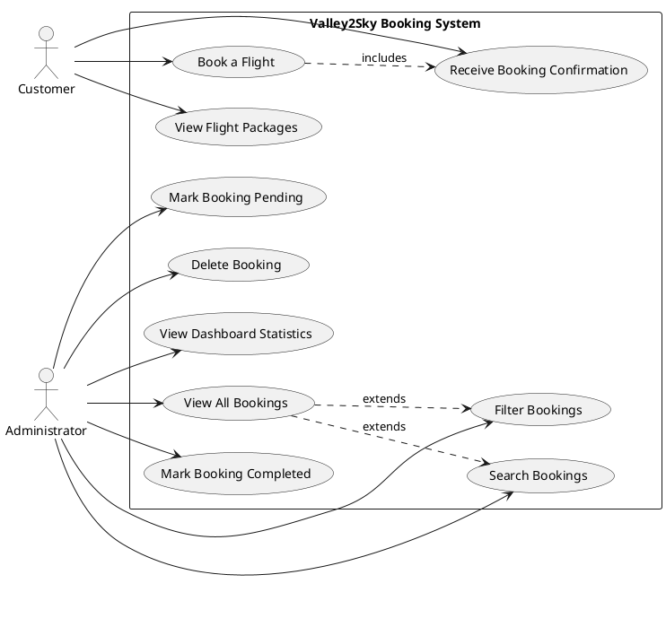
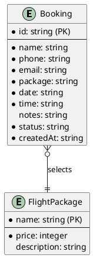

# Valley2Sky Paragliding – Online Booking System

A responsive, web-based MVP booking system for a paragliding business called **Valley2Sky Paragliding**. Built with HTML, CSS, and vanilla JavaScript, this project serves as a university assignment prototype. All data is persisted using the browser's **Local Storage** — no backend, database, or external frameworks are used.

---

## Project Explanation

### Purpose

Valley2Sky Paragliding offers tandem paragliding experiences in Malaysia's scenic highlands. This system allows customers to:

- Browse available flight packages (Basic, Premium, Sunset)
- Submit booking requests via a validated form
- Receive an instant booking confirmation with a unique ID
- Have their booking stored locally for admin retrieval

Administrators can:

- View all bookings in a structured table
- Mark bookings as **Completed** or **Pending**
- Delete unwanted bookings
- Search by customer name
- Filter by booking status
- View dashboard statistics (total, pending, completed)

### Architecture

The system uses a **three-page architecture**:

| Page | Purpose |
|------|---------|
| `index.html` | Home / landing page with branding, hero section, package cards |
| `booking.html` | Booking form with validation and confirmation display |
| `admin.html` | Admin dashboard with table, stats, search, and filter |

JavaScript is split into three files for separation of concerns:

- `js/app.js` — Shared utilities: Local Storage CRUD, notification system, validation helpers
- `js/booking.js` — Booking form logic: validation, submission, confirmation rendering
- `js/admin.js` — Admin dashboard logic: table rendering, stats, search, filter, status updates

### Design

- **Color palette:** Deep blues, emerald greens, and amber sunset tones inspired by sky, mountains, and nature
- **Responsive:** Works on desktop, tablet, and mobile via CSS media queries
- **CSS variables** for consistent theming across all pages

---

## Local Storage Implementation Explanation

### Storage Key

All bookings are stored under a single Local Storage key:

```javascript
const STORAGE_KEY = 'valley2skyBookings';
```

### CRUD Operations

| Operation | Function | Location |
|-----------|----------|----------|
| **Read** | `getBookings()` | `js/app.js` |
| **Create** | `saveBookings(bookings)` | `js/app.js` |
| **Update** | `saveBookings(bookings)` after mutation | `js/admin.js` |
| **Delete** | `saveBookings(bookings)` after filtering | `js/admin.js` |

### Data Flow

1. A customer fills in the booking form on `booking.html`
2. Form validation runs client-side (required fields, email format, phone format, date not in past, duplicate time-slot prevention)
3. On successful validation, a new booking object is created with a unique ID (`V2S-XXX`), timestamp, and default status `"Pending"`
4. `getBookings()` retrieves the existing array from Local Storage
5. The new booking is pushed to the array
6. `saveBookings(bookings)` writes the updated array back to Local Storage
7. A confirmation screen displays the booking details
8. On the admin dashboard, `getBookings()` reads all bookings, filter/search is applied client-side, and the table is rendered dynamically

### Data Structure

```javascript
{
  id: "V2S-001",
  name: "John Doe",
  phone: "0123456789",
  email: "john@email.com",
  package: "Premium Flight",
  date: "2026-06-15",
  time: "10:00 AM",
  notes: "",
  status: "Pending",
  createdAt: "2026-06-04T12:00:00"
}
```

### Duplicate Prevention

Before saving a booking, the system checks if any existing booking has the same `date` AND `time` values using `isDuplicateBooking()`. If a match is found, the form submission is blocked and an inline error message is shown on the time slot field.

---

## Use Case Diagram (PlantUML)



---

## ERD (PlantUML)



> **Note:** In this MVP, `FlightPackage` is defined as a JavaScript array in `booking.js` rather than a separate entity, but the ERD shows the conceptual relationship.

---

## User Stories

1. As a **customer**, I want to view available flight packages so I can choose the one that suits me best.
2. As a **customer**, I want to fill in a booking form with my details so I can reserve a tandem flight.
3. As a **customer**, I want the form to validate my input so I don't submit incorrect information.
4. As a **customer**, I want to see a confirmation with my booking ID so I know my booking was successful.
5. As a **customer**, I want to be notified if my chosen date and time are already booked so I can pick an alternative.
6. As an **administrator**, I want to view all bookings in a table so I can manage them efficiently.
7. As an **administrator**, I want to mark bookings as Completed or Pending so I can track their progress.
8. As an **administrator**, I want to delete bookings that are no longer relevant.
9. As an **administrator**, I want to search bookings by customer name so I can find specific records quickly.
10. As an **administrator**, I want to filter bookings by status so I can focus on pending or completed items.
11. As an **administrator**, I want to see dashboard statistics so I can get an overview of booking volumes.

---

## Functional Requirements

| ID | Requirement |
|----|-------------|
| FR1 | The system shall display a home page with Valley2Sky branding, a hero section, and three flight packages. |
| FR2 | The system shall provide a booking form with fields: Full Name, Phone Number, Email Address, Flight Package, Flight Date, Time Slot, and Special Notes. |
| FR3 | The system shall validate that all required fields are filled in before submission. |
| FR4 | The system shall validate that the email address follows standard email format. |
| FR5 | The system shall validate that the phone number matches Malaysian mobile format (01X-XXXXXXXX). |
| FR6 | The system shall validate that the selected flight date is not in the past. |
| FR7 | The system shall prevent duplicate bookings for the same date and time slot. |
| FR8 | Upon successful booking, the system shall generate a unique booking ID (V2S-XXX). |
| FR9 | The system shall display a booking confirmation with all submitted details. |
| FR10 | The system shall save all bookings to the browser's Local Storage. |
| FR11 | The system shall provide an admin dashboard that displays all bookings in a table. |
| FR12 | The admin dashboard shall show statistics: total bookings, pending, and completed. |
| FR13 | Administrators shall be able to mark bookings as Completed or Pending. |
| FR14 | Administrators shall be able to delete bookings. |
| FR15 | The admin dashboard shall support searching bookings by customer name. |
| FR16 | The admin dashboard shall support filtering bookings by status. |

---

## Non-Functional Requirements

| ID | Requirement |
|----|-------------|
| NFR1 | The system shall be built using only HTML, CSS, and vanilla JavaScript with no external libraries or frameworks. |
| NFR2 | All data shall be stored client-side using the browser's Local Storage. |
| NFR3 | The system shall be fully responsive and work on desktop, tablet, and mobile devices. |
| NFR4 | The visual design shall follow a modern adventure tourism aesthetic with a sky/mountains/nature color palette. |
| NFR5 | The system shall use semantic HTML elements for accessibility. |
| NFR6 | Navigation shall use CSS variables for consistent theming and easy maintenance. |
| NFR7 | JavaScript code shall be organized into reusable functions with clear separation of concerns. |
| NFR8 | The system shall work immediately by opening `index.html` in any modern browser with no build step. |
| NFR9 | Error messages and notifications shall be displayed using a consistent toast notification system. |
| NFR10 | Empty-state messages shall be displayed when no bookings exist in the admin dashboard. |
| NFR11 | CSS hover effects and smooth transitions shall be applied to interactive elements. |

---

## Project Structure

```
/
├── index.html              # Home / landing page
├── booking.html            # Booking form page
├── admin.html              # Admin dashboard page
├── README.md               # Documentation
├── css/
│   └── style.css           # All styles (CSS variables, responsive, theming)
├── js/
│   ├── app.js              # Shared utilities (Local Storage, notifications, validation)
│   ├── booking.js          # Booking form logic
│   └── admin.js            # Admin dashboard logic
└── assets/
    └── images/             # Image assets (placeholder)
```

---

## How to Run

1. Download or clone the project files.
2. Open `index.html` in any modern web browser (Chrome, Firefox, Edge, Safari).
3. No server, build step, or installation required.

---

## Browser Compatibility

- Chrome 60+
- Firefox 55+
- Safari 11+
- Edge 16+

Local Storage is supported in all modern browsers.
